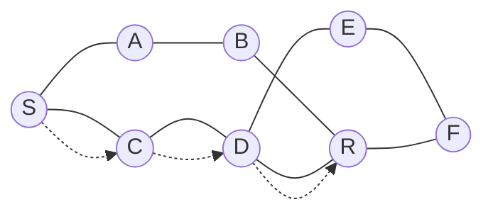

> Date : 22 July 2026
## Lecture 01


> [!important] Important
> Class Test 01
> - OSI Model
> - TCP/IP Model
> 
> Mid Term
> - Network Topology *(Must Study)*

> [!warning] Warning
> For **Makeup CT** or **Late Assignment**:
> - Inform the faculty **before the deadline**.
> - Provide a **valid reason** for the request.

#### Slide
- [Lecture 1](https://drive.google.com/file/d/11FsHpTjF-7ADbMRhLOtCic6QzQlehwMg/view?usp=drive_link)

> Date : 23 July 2026 ❌

> Date : 29 July 2026 ❌

> Date : 30 July 2026

## Lecture 02

There are **5 basic components** of data communication:

1. **Sender** --> The device that sends the data.
2. **Receiver** --> The device that receives the data.
3. **Message** --> The information or data being communicated.
4. **Transmission Medium** --> The physical or wireless path through which data travels. Example: cable, fiber optic, radio waves.        
5. **Protocol** --> A set of rules that controls how data is communicated between devices.
        
Slides:

- [Lecture 2 (Part 1)](https://drive.google.com/file/d/1WqG-c_PtC-TI5Pdlrn55cUg23rt5P8tO/view?usp=drive_link)
- [Lecture 2 (Part 2)](https://drive.google.com/file/d/1CB8Jf823VxpV4alUhll6P1fvC7hPYt3-/view?usp=drive_link)


> **Date:** 06 August 2026

## Lecture 03

**OSI → Open Systems Interconnection**

> The OSI model has **7 layers**.

#### Why "Open"?

- The model is **not limited to one company**.
- Different systems, such as **Windows and Linux**, can use the model.
#### 7 Layers of OSI Model

##### Software Layers

1. **Application**
2. **Presentation**
3. **Session**

##### Hardware / Lower Layers

4. **Transport**
5. **Network**
6. **Data Link**
7. **Physical**
#### Presentation Layer

The **Presentation Layer** deals with the representation and transformation of data.

- **Translation** → Converts data into a **common format**.
- **Compression** → Reduces the **number of bits** needed to represent data.
- **Encryption** → Provides **security** by converting data into an encoded form.

#### Compression

Compression can be:
- **Lossy** → Some data is removed to reduce the size.
- **Lossless** → Data can be restored to its original form without losing information.
#### Session Layer

The **Session Layer** is responsible for managing communication sessions between applications.

- **Authentication** → Verifies the identity of a user.
- **Authorization** → Determines what an authenticated user is allowed to access.
- **Session Management** → Establishes, manages, and terminates a communication session.

Example

```text
  LIBRARY
     ↓
  ENTER ME
   ↙    ↘
  CSE   BBA
 ↙    ↘
BOOKS  CAMERA
```

#### Communication Modes

Half-Duplex --> Data can travel in **both directions**, but not at the same time. **Ex:** Walkie-Talkie

Full-Duplex --> Data can travel in **both directions at the same time**. **Ex:** Mobile phone communication

> Date: 12 August 2026

## Lecture 4

```plaintext
OSI — 7 Layers
│
├── 7. Application
│
├── 6. Presentation
│   ├── Translation
│   ├── Encryption
│   └── Compression
│
├── 5. Session
│   ├── Authentication
│   ├── Authorization
│   └── Session Management
│
├── 4. Transport
│   └── Process-to-Process Delivery
│
├── 3. Network
│
├── 2. Data Link
│
└── 1. Physical

```

#### Transport Layer

> **Main responsibility:** Process-to-Process Delivery

The Transport Layer provides communication between **processes/applications** running on different devices.

Main Functions:

1. **Port Addressing**
   
Port numbers identify the **specific process/application** that should send or receive data.

```text
                HUB
              /  |  \
             /   |   \
        Phone    P2   P3 (Receiver)
          |             |
       WhatsApp      WhatsApp
       Port 1000     Port 1200
        (Sender)      (Receiver)
```

> **Example:** Data is sent from a WhatsApp process using **port 1000** to a WhatsApp process using **port 1200**.

2. Segmentation and Reassembly

Large data is divided into smaller **segments** before transmission.

```text
H E L L O
│ │ │ │ │
1 2 3 4 5
```

Each segment can have a **sequence number**.

```text
Segment 1
Segment 2
Segment 3
Segment 4
Segment 5
```

The receiver uses the sequence numbers to **reassemble the data in the correct order**.

> Data can arrive in a different order, but it can be reassembled correctly using sequence numbers.

```text
Example: Segmentation & Reassembly

Original Data:
HELLO

Sender                              Receiver
  │                                    │
  │  [1:H] ─────────────────────────→  │
  │  [3:L] ─────────────────────────→  │
  │  [5:O] ─────────────────────────→  │
  │  [2:E] ─────────────────────────→  │
  │  [4:L] ─────────────────────────→  │
  │                                    │
  │                              Received:
  │                              H L O E L
  │                                    │
  │                              Reassembly
  │                              using sequence
  │                              numbers
  │                                    ↓
  │                                  HELLO
```

3. Flow Control

Controls the **rate of data transmission** so that the receiver is not overwhelmed by too much data.

4. Error Control

Helps ensure that data is delivered **correctly and reliably**.

If data is lost or received incorrectly, the transport layer can take action to ensure correct delivery.

> [!summary] summary
> **Transport Layer → Process-to-Process Delivery**
> 
> **Port Addressing → Identifies the process**  
> **Segmentation → Divides data into segments**  
> **Sequence Number → Helps reassemble segments**  
> **Flow Control → Controls data flow**  
> **Error Control → Handles transmission errors**

#### Protocols

1. **TCP (Transmission Control Protocol)** --> Connection-oriented**
2. **UDP (User Datagram Protocol)** --> **Connectionless**

### TCP — Connection-Oriented

A connection is established before sending data.



> The network finds a suitable/shortest path for the data packet to reach the receiver.

Data Packet Tracking: Possible path: S → C → D → R. Route with less cost is selected.

#### Network Layer

> **Main responsibility:** Host-to-Host Delivery

1. **Logical Addressing**    
    - Uses logical addresses such as **IP addresses** to identify hosts.
2. **Packetizing**
    - The Network Layer takes the segment from the Transport Layer and encapsulates it into a **packet**.

The network packet contains addressing information such as:

```text
┌─────────────────────────────────Packet─────────────────────────────────┐
│			   ┌──────────────────Segment─────────────────┐              │
│──────────────│──────────────┬────────────┬──────────────│──────────────│
│ Source       │ Source       │ Sequence   │ Receiver     │ Receiver     │
│ IP Address   │ Port Address │ Number     │ Port Address │ IP Address   │
└──────────────┴──────────────┴────────────┴──────────────┴──────────────┘
```


2. Data Link Layer

> **Main responsibility:** Node-to-Node Delivery

1. **Physical Addressing** --> Uses **MAC Address** to identify devices on a local network.
2. **Framing** -> Divides the data received from the Network Layer into **frames**.
3. **Error Control** --> Detects and handles errors that occur during transmission.
4. **Flow Control** --> Controls the rate of data transmission between connected devices.
5. **Access Control** --> Controls which device can access the shared transmission medium.

```text

		            ┌──────────Frame────────────┐   
		            │  ┌───────Packet───────┐   │ 
  ┌──────────────────┐ │ ┌────────────────┐ │ ┌────────────────────┐ 
  │Source Mac Address│ │ │    Segment     │ │ │ Reciver Mac Address│   
  └──────────────────┘ │ └────────────────┘ │ └────────────────────┘  
			        │  └────────────────────┘   │ 
		            └───────────────────────────┘

```

> **MAC Address → Physical Address**

1. Physical Layer

> The Physical Layer is responsible for transmitting **raw bits** through the physical medium.

1. **Physical Characteristics of Media**    
    - Defines the physical properties of the transmission medium.
2. **Topology**
    - Describes how devices are physically or logically connected.
    - **Check the topology slide.**
3. **Data Rate**
    - Defines the rate at which bits are transmitted.

#### TCP/IP Model

> **TCP/IP → 4 Layers**

The TCP/IP model is a practical model used for computer networking.

```text
TCP/IP — 4 Layers
│
├── 1. Application
├── 2. Transport
├── 3. Internet
└── 4. Network Access
```

> Layer Mapping

```text
OSI                     TCP/IP

Application  ───────┐
Presentation ───────┤──→ Application
Session      ───────┘

Transport   ───────────→ Transport

Network     ───────────→ Internet

Data Link   ─────────┐
Physical    ─────────┴──→ Network Access
```

> Date: 13 August 2026

## Lecture 5

> **Remember / Memorize the concepts from this lecture.** --> Lecture 3 (Part 2)

#### Connection Types

```text
Connectionless
    │
    └── No connection established

Connection-Oriented
    │
    └── Connection established
            ↓
         Send Data
```

**DNS → Domain Name System**

DNS converts a **host/domain name** into an **IP address**.

```text
Host Name                      www.vits.com
    │                                │
    │ DNS                            │  DNS 
    ▼                                ▼
IP Address                     192.168.25.0
```

> [!important] important
> Mid-term Suggestion: DNS

#### RPC — Remote Procedure Call

RPC allows a program to request a service or procedure from another system as if it were a local procedure call.

```text
Mobile App
    │
    │ RPC Request
    ▼
get-Account-Balance (0176)
    │
    └── Account No.
```

The request can contain information such as the **bank/account number**.

#### Addressing

- **Logical Address → IP Address**
	- Used to identify a device logically on a network.

- **Physical Address → MAC Address**
	- Used to identify a device at the Data Link Layer.

> [!important] important
> Class Test --> 19 AUG 2026 (WED)
> 
>> Topics
>- TCP
>- DSI
> 
>>Things to Review
>- **Protocol & Differences**
>- **Physical, Logical & Port Address**
>- **Control**
>- **Transport, Network & Data Link**
>- **Which layer works for which function?**
>
>>**Review the slides --> L3 (Part 1 & Part 2).**


