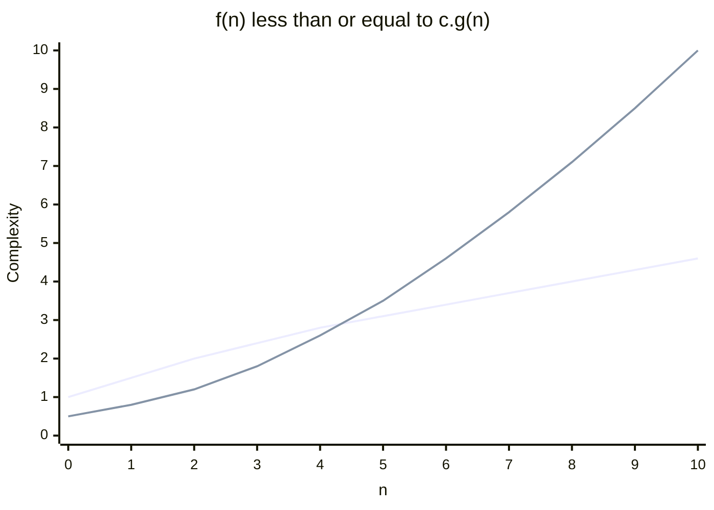
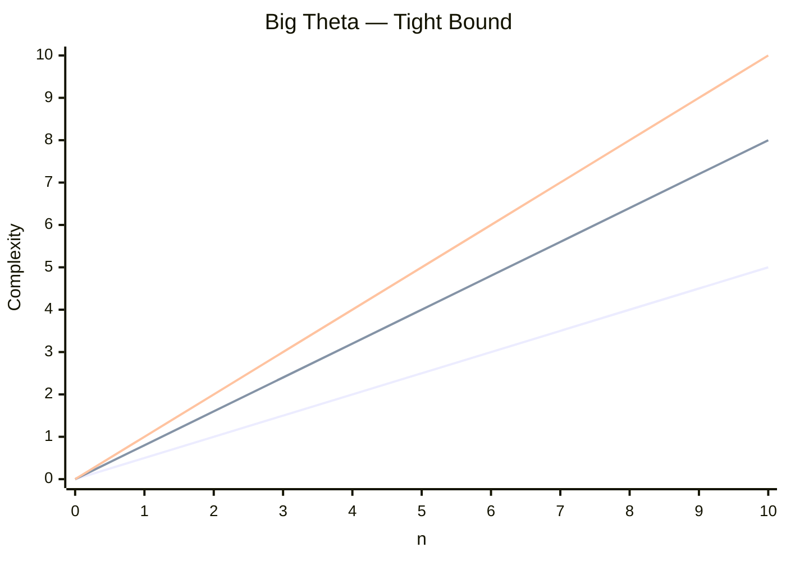

> [!warning] Warning
> **Notice — DSA Note**  
> **Do not follow this DSA note as a complete or finalized note.**
> 
> This note currently contains only what the teacher has taught in class. The content is **messy and not properly organized**, and additional **slides, books, and other study materials** have been added.
> 
> **For now, only follow the topics and explanations covered by the teacher in class. **The slides and books are included as references and will be organized later.

> Date: 26 July 2026
## Lecture 1

#### **Book:** 
- [Introduction to Algorithms - Third Edition](https://drive.google.com/file/d/1XBMjjxjUONvaBhW0oBcmrycCFL7ImYwp/view?usp=drive_link)

> **Date:** 27 July 2026
## Lecture 2

- Complexity
- **Big-O** → **Upper Bound**



> Need to find out: $f(n)\leq c\cdot g(n)$

#### Slide: 
- [Analysis of Algorithm](https://drive.google.com/file/d/1zfRDYj1e65sXOCuM7hTLrtmch8T251Rs/view?usp=drive_link)

> **Date:** 02 August 2026
## Lecture 3

<u>Big O</u>
$c\cdot g(n)\geq f(n)$ → **Upper Bound**

> at least — find out one $c$ value.

<u>Big Omega</u>

$c\cdot g(n)\leq f(n)$ → **Lower Bound**

<u>Big Theta ($\Theta$)</u>

→ **Tight Bound**
- To find out the **perfect range**, we need tight bound.


> [!error] error
> P18, P19 Questions <-- Slide --> Analysis of Algorithm
> 

<u>Divide and Conquer</u> <-- P21

- General Formula: $T(n)=\begin{cases}\Theta(1), & \text{if } n\leq 1\\aT\left(\frac{n}{b}\right)+f(n), & \text{if } n>1\end{cases}$

Where:

- $n$ → **Problem size**
- $a$ → Number of **sub-problems**
- $\frac{n}{b}$ → **Sub-problem size**
- $f(n)$ → Additional work done outside the recursive sub-problems

- **Substitution Method**, Recursion Tree ← review it 

> **Date:** 03 August 2026

## Lecture 4

Merge Sort

> PDF 2 → Page 7

```text
        ┌─────┐
        └──┬──┘
       ┌───┴───┐
     ┌───┐   ┌───┐
     └─┬─┘   └─┬─┘
       └───┬───┘
         ┌─┴─┐
         └───┘
```

To avoid overflow, we use this formula: $\ell+\frac{r-\ell}{2}$

Otherwise, we can also use: $\frac{\ell+r}{2}$

> **N.B:** These two formulas are equal.
#### Rules
1. **Divide**
2. **Compare** each
3. **Merge them**

>[!info] info
>Theory Question Type
>- Visualization
>- Solve code

Given array:

$[9,\ 2,\ 35,\ 11,\ 18,\ 13,\ 100,\ 38,\ 92]$

Step 1 — Divide

```text
[9, 2, 35, 11, 18, 13, 100, 38, 92]

          ↓ Divide

[9, 2, 35, 11]        [18, 13, 100, 38, 92]

          ↓

[9, 2] [35, 11]      [18, 13] [100, 38] [92]
````

Step 2 — Compare and Sort

```text
[9, 2]       → [2, 9]
[35, 11]     → [11, 35]

[18, 13]     → [13, 18]
[100, 38]    → [38, 100]
[92]         → [92]
```

Step 3 — Merge

```text
[2, 9] + [11, 35]
        ↓
[2, 9, 11, 35]

[13, 18] + [38, 100]
        ↓
[13, 18, 38, 100]

[2, 9, 11, 35] + [13, 18, 38, 100] + [92]
        ↓
[2, 9, 11, 13, 18, 35, 38, 92, 100]
```

#### Slide:
- [Merge Sort](https://drive.google.com/file/d/1B-YBVZnQxWTZ7aN1P7U_DdnJwa-4CRMp/view?usp=drive_link)

> Data: 09 August 2026
## Lecture 5

- Quick, Counting, Radix Sort
#### Steps of Quick Sort
1. **Pivot Selection**
2. **Partition**
3. **Recursive Solve**

There are three approaches:

1. **Naive Approach**
2. **Lomuto Partition**
3. **Hoare Partition**

> Date: 10 Aug 2026
## Lecture 6

#### Radix Sort
  [Edit Writing](https://youtu.be/2arL1jh8ihA?type=inkWriting&aspectRatio=1.569)
