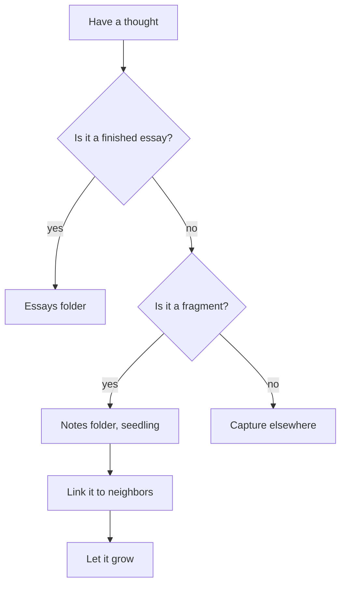
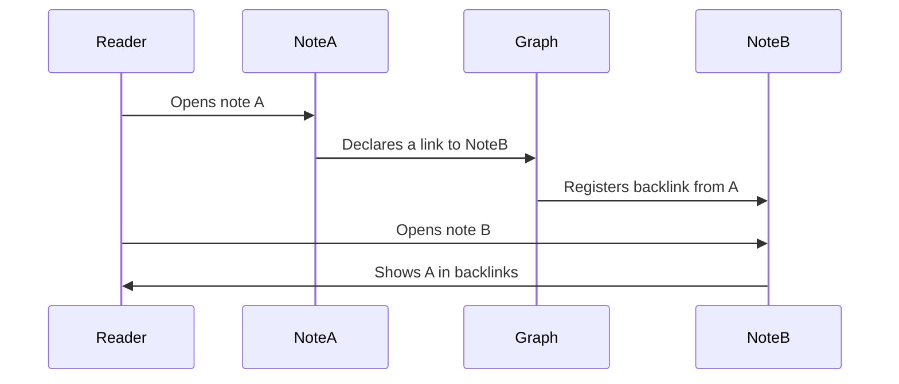
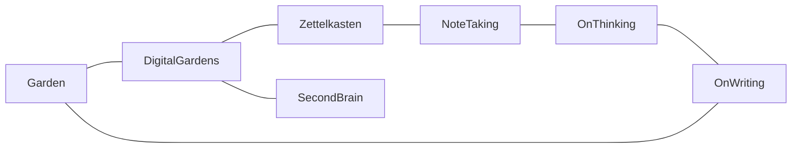

Sometimes an idea is a shape, not a sentence. Mermaid lets you describe diagrams as text and have them render inline. Because the source is plain text, diagrams stay diff-able, searchable, and editable the same way the rest of a note is — no dragging boxes around in a GUI.

Diagrams render client-side, so on first paint you may see the raw source briefly before the diagram paints in. That's normal.

## A flowchart

A simple decision tree for whether a note belongs in the garden:

## A sequence diagram

How a backlink actually resolves between two notes:

## A graph

The shape of a small garden, nodes connected the way ideas are:

## When to reach for Mermaid

Mermaid shines for *structural* ideas — flows, relationships, sequences. For *quantitative* ideas, [[Math and LaTeX]] is the better fit. And for soft admonitions scattered through prose, [[Callouts Reference]] keeps things tidy. Pick the tool that matches the shape of the thought.
