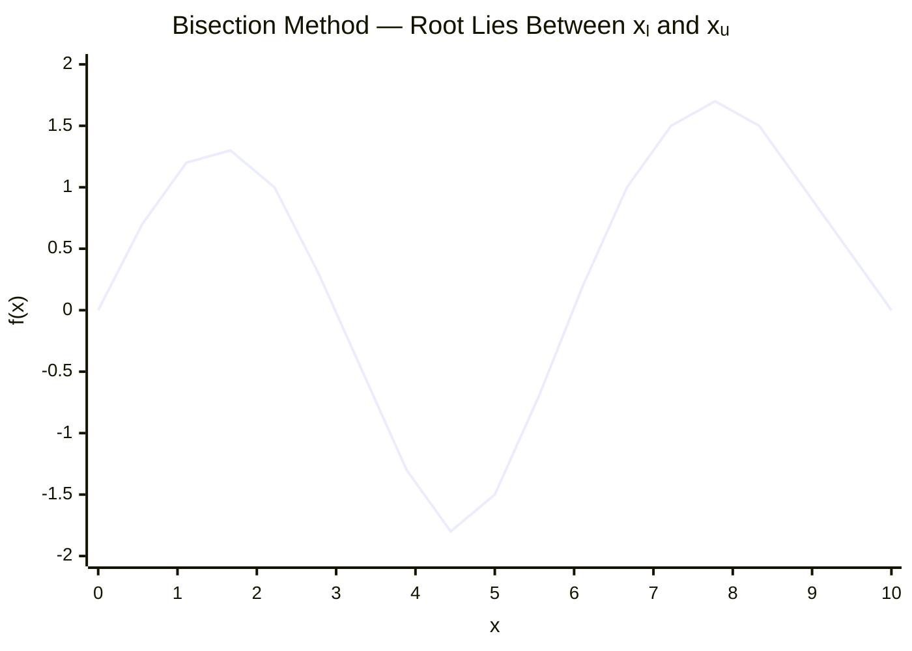

> Date: 22 July 2026
## Lecture 01

Numerical methods are used **to obtain approximate solutions** to mathematical problems.
### Error

- True Error
	- Difference between the exact value and the approximate value.

$$
\text{True Error} = \text{True Value} - \text{Approximate Value}
$$

- Approximate Error
	- Difference between two successive approximations.

$$
\text{Approximate Error} = \text{Present Approximate Value} - \text{Previous Approximate Value}
$$

Approximate Value: $f'(x)\approx\frac{f(x+h)-f(x)}{h}$

True Value $\frac{d}{dx}$

> **Date:** 26 July 2026

## Lecture 02
#### True Value & Approximate Value

- Error

	- True Error --> $E_T = \text{True Value} - \text{Approximate Value}$
	- Approximate Error --> $E_A = \text{Present Approximation} - \text{Previous Approximation}$
	- Relative True Error --> $\epsilon_T = \frac{\text{True Error}}{\text{True Value}}$
	- Relative Approximate Error --> $\epsilon_A = \frac{\text{Approximate Error}}{\text{Present Approximation}}$

- Absolute Relative True Error

$$
|\epsilon_T|
=
\left|
\frac{\text{True Error}}{\text{True Value}}
\right|
\times 100\%
$$

- Absolute Relative Approximate Error

$$
|\epsilon_A|
=
\left|
\frac{\text{Approximate Error}}
{\text{Present Approximation}}
\right|
\times 100\%
$$

#### Root of Non-Linear Equation
--> Bisection Method

Given function:

$$
f(x)=0
$$
1. Choose two values $x_l$ and $x_u$ 
- $x_l$ → Lower value
- $x_u$ → Upper value

Such that: $x_u > x_l$

if, $f(x_l)\times f(x_u)<0$

Then, the root lies between $x_l$ and $x_u$.

2. The midpoint of $x_l$ and $x_u$:

$$
x_m=\frac{x_l+x_u}{2}
$$

3. Check the Midpoint

=> Case 1: $f(x_m)\times f(x_l)<0$
The root lies between $x_l$ and $x_m$. That's why the value of $x_l$ will be unchanged and $x_u=x_m$

=> Case 2: $f(x_m)\times f(x_l)>0$

The root lies between $x_m$ and $x_u$. That's why the value of $x_u$ will be unchanged and $x_l=x_m$

=> Case 3: $f(x_m)\times f(x_l)=0$   $\therefore$ $x_m=\text{root}$

4. $x_m=\frac{x_l+x_u}{2}$

5. The absolute relative approx. error

$$
|E_A|
=
\left|
\frac{x_m^{new}-x_m^{old}}
{x_m^{new}}
\right|
\times 100\%
$$

>[!question] Question
>Given, $f(x)=x^3-20$
>Use initial lower and upper guesses of $1$ and $4$ respectively. Conduct some iterations to estimate the root of the equation. Find the absolute relative approximate error at the end of each iteration.

`Solution:`

Here, 
- $x_l=1$ So, $f(x_l)=1^3-20=-19$
- $x_u=4$ So, $f(x_u)=4^3-20=44$

Then, $f(x_l)\times f(x_u)=(-19)(44)=-836<0$

Therefore, the root lies between $x_l$ and $x_u$.

<u>Iteration 1:</u>
$$
x_m=\frac{x_l+x_u}{2}=\frac{1+4}{2}=2.5
$$

Now, $f(x_m)=2.5^3-20=-4.375$

Since, $f(x_m)\times f(x_l)>0$

So, $f(x_m)\times f(x_l)=-4.375\times(-19)=83.125>0$

The root lies between $x_m$ and $x_u$.

$$x_l=x_m=2.5$$
$$x_u=4$$

<u>Iteration 2:</u>

$$
x_m=\frac{x_l+x_u}{2}=\frac{2.5+4}{2}=3.25
$$

Now, $f(x_m)=f(3.25)=3.25^3-20=14.328125$

Since, $f(x_m)\times f(x_l)<0$

So, $f(x_m)\times f(x_l)=14.328125\times(-4.375)=-62.68555<0$

The root lies between $x_l$ and $x_m$.

$$x_u=x_m=3.25$$

Absolute relative approximate error:

$$
|E_A|
=
\left|
\frac{x_m^{new}-x_m^{old}}
{x_m^{new}}
\right|
\times100\%
=
\left|
\frac{3.25-2.5}{3.25}
\right|
\times100\%
=23.0769\%
$$

<u>Iteration 3:</u>

$$
x_m=\frac{x_l+x_u}{2}
=\frac{2.5+3.25}{2}=2.875
$$

Now, $f(x_m)=f(2.875)=2.875^3-20=3.763671875$

Since, $f(x_m)\times f(x_l)<0$

So,

$$
f(x_m)\times f(x_l)
=
3.763671875\times(-4.375)
=
-16.46606445<0
$$

The root lies between $x_l$ and $x_m$.

$$
x_u=x_m=2.875
$$

Absolute relative approximate error:

$$
|E_A|
=
\left|
\frac{2.875-3.25}{2.875}
\right|
\times100\%
=
13.04348\%
$$

<u>Iteration 4:</u>

$$
x_m=\frac{2.5+2.875}{2}=2.6875
$$

Now, $f(x_m)=2.6875^3-20=-0.589111328125$

Since, $f(x_m)\times f(x_l)>0$

So,

$$
f(x_m)\times f(x_l)
=
(-0.589111328125)\times(-4.375)
=
2.57736206>0
$$

The root lies between $x_m$ and $x_u$.

$$
x_l=x_m=2.6875
$$

$$
|E_A|
=
\left|
\frac{2.6875-2.875}{2.6875}
\right|
\times100\%
=
6.97674\%
$$

<u>Iteration 5:</u>

$$
x_m=\frac{2.6875+2.875}{2}=2.78125
$$

Now, $f(x_m)=2.78125^3-20=1.513946533203125$

Since, $f(x_m)\times f(x_l)<0$

So,

$$
f(x_m)\times f(x_l)
=
1.513946533203125\times(-0.589111328125)
=
-0.89188305<0
$$

The root lies between $x_l$ and $x_m$.

$$
x_u=x_m=2.78125
$$

$$
|E_A|
=
\left|
\frac{2.78125-2.6875}{2.78125}
\right|
\times100\%
=
3.37079\%
$$

<u>Iteration 6:</u>

$$
x_m=\frac{2.6875+2.78125}{2}=2.734375
$$

Now, $f(x_m)=2.734375^3-20=0.444393158203125$

Since, $f(x_m)\times f(x_l)<0$

So,

$$
f(x_m)\times f(x_l)
=
0.444393158203125\times(-0.589111328125)
=
-0.26179704<0
$$

The root lies between $x_l$ and $x_m$.

$$
x_u=x_m=2.734375
$$

$$
|E_A|
=
\left|
\frac{2.734375-2.78125}{2.734375}
\right|
\times100\%
=
1.71429\%
$$

<u>Iteration 7:</u>

$$
x_m=\frac{x_l+x_u}{2}
=
\frac{2.6875+2.734375}{2}
=
2.7109375
$$

Now, $f(x_m)=f(2.7109375)$

$$
f(x_m)
=
2.7109375^3-20
=
-0.0768265724
$$

Since, $f(x_m)\times f(x_l)>0$

So,

$$
f(x_m)\times f(x_l)
=
(-0.0768265724)\times(-0.589111328125)
=
0.04525940>0
$$

The root lies between $x_m$ and $x_u$.

$$
x_l=x_m=2.7109375
$$

Absolute relative approximate error:

$$
|E_A|
=
\left|
\frac{x_m^{new}-x_m^{old}}
{x_m^{new}}
\right|
\times100\%
=
\left|
\frac{2.7109375-2.734375}
{2.7109375}
\right|
\times100\%
=0.86455\%
$$
