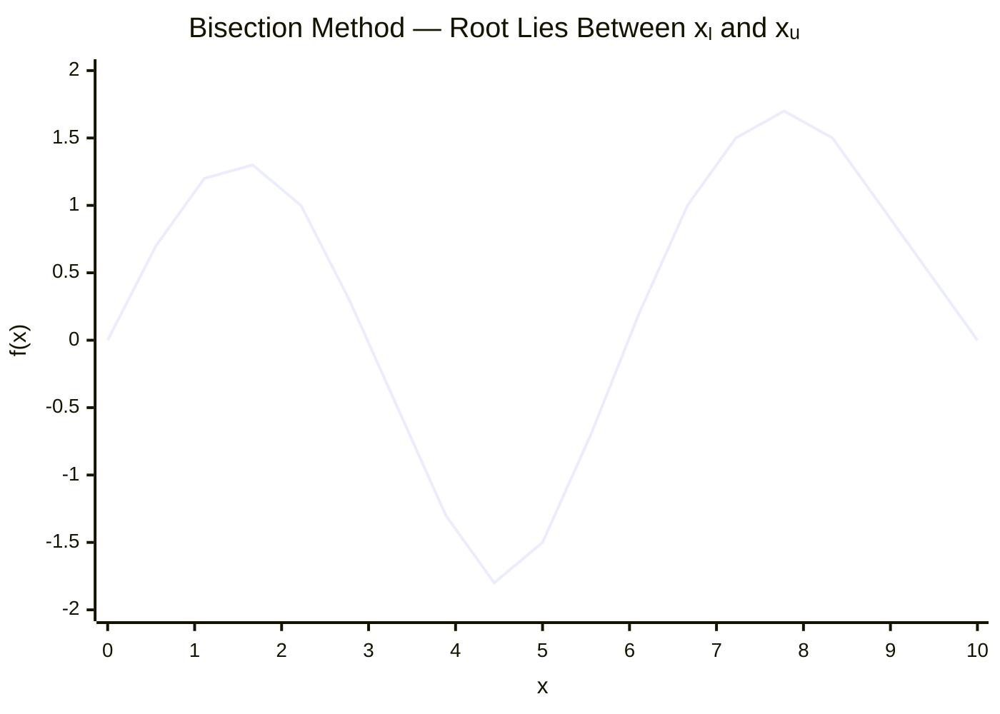
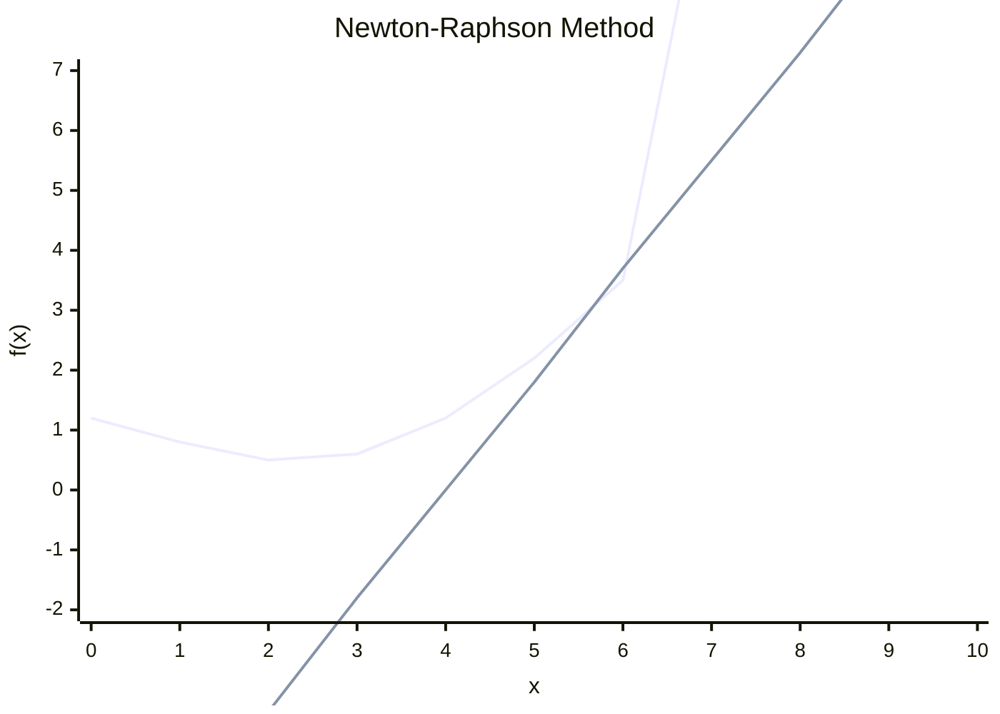
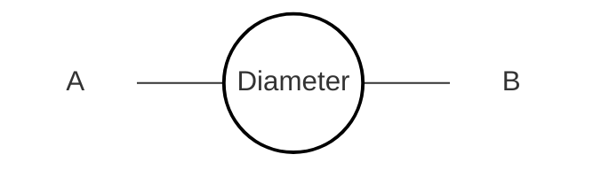

> Date: 22 July 2026
## Lecture 01

Numerical methods are used **to obtain approximate solutions** to mathematical problems.
### Error

- True Error
	- Difference between the exact value and the approximate value.

$$
\text{True Error} = \text{True Value} - \text{Approximate Value}
$$

- Approximate Error
	- Difference between two successive approximations.

$$
\text{Approximate Error} = \text{Present Approximate Value} - \text{Previous Approximate Value}
$$

Approximate Value: $f'(x)\approx\frac{f(x+h)-f(x)}{h}$

True Value $\frac{d}{dx}$


> **Date:** 26 July 2026

## Lecture 02
#### True Value & Approximate Value

- Error

	- True Error --> $E_T = \text{True Value} - \text{Approximate Value}$
	- Approximate Error --> $E_A = \text{Present Approximation} - \text{Previous Approximation}$
	- Relative True Error --> $\epsilon_T = \frac{\text{True Error}}{\text{True Value}}$
	- Relative Approximate Error --> $\epsilon_A = \frac{\text{Approximate Error}}{\text{Present Approximation}}$


- Absolute Relative True Error

$$
|\epsilon_T|
=
\left|
\frac{\text{True Error}}{\text{True Value}}
\right|
\times 100\%
$$

- Absolute Relative Approximate Error

$$
|\epsilon_A|
=
\left|
\frac{\text{Approximate Error}}
{\text{Present Approximation}}
\right|
\times 100\%
$$


#### Root of Non-Linear Equation
--> Bisection Method

Given function:

$$
f(x)=0
$$
1. Choose two values $x_l$ and $x_u$ 
- $x_l$ → Lower value
- $x_u$ → Upper value

Such that: $x_u > x_l$

if, $f(x_l)\times f(x_u)<0$

Then, the root lies between $x_l$ and $x_u$.



2. The midpoint of $x_l$ and $x_u$:

$$
x_m=\frac{x_l+x_u}{2}
$$


3. Check the Midpoint

=> Case 1: $f(x_m)\times f(x_l)<0$

The root lies between $x_l$ and $x_m$. That's why the value of $x_l$ will be unchanged and $x_u=x_m$

=> Case 2: $f(x_m)\times f(x_l)>0$

The root lies between $x_m$ and $x_u$. That's why the value of $x_u$ will be unchanged and $x_l=x_m$

=> Case 3: $f(x_m)\times f(x_l)=0$   $\therefore$ $x_m=\text{root}$

4. $x_m=\frac{x_l+x_u}{2}$

5. The absolute relative approx. error

$$
|E_A|
=
\left|
\frac{x_m^{new}-x_m^{old}}
{x_m^{new}}
\right|
\times 100\%
$$

>[!question] Question
>Given, $f(x)=x^3-20$
>Use initial lower and upper guesses of $1$ and $4$ respectively. Conduct some iterations to estimate the root of the equation. Find the absolute relative approximate error at the end of each iteration.

`Solution:`

Here, 
- $x_l=1$ So, $f(x_l)=1^3-20=-19$
- $x_u=4$ So, $f(x_u)=4^3-20=44$

Then, $f(x_l)\times f(x_u)=(-19)(44)=-836<0$

Therefore, the root lies between $x_l$ and $x_u$.

<u>Iteration 1:</u>
$$
x_m=\frac{x_l+x_u}{2}=\frac{1+4}{2}=2.5
$$

Now, $f(x_m)=2.5^3-20=-4.375$

Since, $f(x_m)\times f(x_l)>0$

So, $f(x_m)\times f(x_l)=-4.375\times(-19)=83.125>0$

The root lies between $x_m$ and $x_u$.

$$x_l=x_m=2.5$$
$$x_u=4$$

<u>Iteration 2:</u>

$$
x_m=\frac{x_l+x_u}{2}=\frac{2.5+4}{2}=3.25
$$

Now, $f(x_m)=f(3.25)=3.25^3-20=14.328125$

Since, $f(x_m)\times f(x_l)<0$

So, $f(x_m)\times f(x_l)=14.328125\times(-4.375)=-62.68555<0$

The root lies between $x_l$ and $x_m$.

$$x_u=x_m=3.25$$

Absolute relative approximate error:

$$
|E_A|
=
\left|
\frac{x_m^{new}-x_m^{old}}
{x_m^{new}}
\right|
\times100\%
=
\left|
\frac{3.25-2.5}{3.25}
\right|
\times100\%
=23.0769\%
$$

<u>Iteration 3:</u>

$$
x_m=\frac{x_l+x_u}{2}
=\frac{2.5+3.25}{2}=2.875
$$

Now, $f(x_m)=f(2.875)=2.875^3-20=3.763671875$

Since, $f(x_m)\times f(x_l)<0$

So,

$$
f(x_m)\times f(x_l)
=
3.763671875\times(-4.375)
=
-16.46606445<0
$$

The root lies between $x_l$ and $x_m$.

$$
x_u=x_m=2.875
$$

Absolute relative approximate error:

$$
|E_A|
=
\left|
\frac{2.875-3.25}{2.875}
\right|
\times100\%
=
13.04348\%
$$


<u>Iteration 4:</u>

$$
x_m=\frac{2.5+2.875}{2}=2.6875
$$

Now, $f(x_m)=2.6875^3-20=-0.589111328125$

Since, $f(x_m)\times f(x_l)>0$

So,

$$
f(x_m)\times f(x_l)
=
(-0.589111328125)\times(-4.375)
=
2.57736206>0
$$

The root lies between $x_m$ and $x_u$.

$$
x_l=x_m=2.6875
$$

$$
|E_A|
=
\left|
\frac{2.6875-2.875}{2.6875}
\right|
\times100\%
=
6.97674\%
$$


<u>Iteration 5:</u>

$$
x_m=\frac{2.6875+2.875}{2}=2.78125
$$

Now, $f(x_m)=2.78125^3-20=1.513946533203125$

Since, $f(x_m)\times f(x_l)<0$

So,

$$
f(x_m)\times f(x_l)
=
1.513946533203125\times(-0.589111328125)
=
-0.89188305<0
$$

The root lies between $x_l$ and $x_m$.

$$
x_u=x_m=2.78125
$$

$$
|E_A|
=
\left|
\frac{2.78125-2.6875}{2.78125}
\right|
\times100\%
=
3.37079\%
$$


<u>Iteration 6:</u>

$$
x_m=\frac{2.6875+2.78125}{2}=2.734375
$$

Now, $f(x_m)=2.734375^3-20=0.444393158203125$

Since, $f(x_m)\times f(x_l)<0$

So,

$$
f(x_m)\times f(x_l)
=
0.444393158203125\times(-0.589111328125)
=
-0.26179704<0
$$

The root lies between $x_l$ and $x_m$.

$$
x_u=x_m=2.734375
$$

$$
|E_A|
=
\left|
\frac{2.734375-2.78125}{2.734375}
\right|
\times100\%
=
1.71429\%
$$

<u>Iteration 7:</u>

$$
x_m=\frac{x_l+x_u}{2}
=
\frac{2.6875+2.734375}{2}
=
2.7109375
$$

Now, $f(x_m)=f(2.7109375)$

$$
f(x_m)
=
2.7109375^3-20
=
-0.0768265724
$$

Since, $f(x_m)\times f(x_l)>0$

So,

$$
f(x_m)\times f(x_l)
=
(-0.0768265724)\times(-0.589111328125)
=
0.04525940>0
$$

The root lies between $x_m$ and $x_u$.

$$
x_l=x_m=2.7109375
$$

Absolute relative approximate error:

$$
|E_A|
=
\left|
\frac{x_m^{new}-x_m^{old}}
{x_m^{new}}
\right|
\times100\%
=
\left|
\frac{2.7109375-2.734375}
{2.7109375}
\right|
\times100\%
=0.86455\%
$$

> Date: 29 July 2026
## Lecture 3

<u>Round Off Error:</u>
--> **Bisection Method** $20.79532839\ldots$

- Take 3 digit ❌
- Take 5 digit ✓

For 5 decimal places: $20.79533$

<u>Truncation Error:</u>

$$
e^x
=
1+x+\frac{x^2}{2!}+\frac{x^3}{3!}+\cdots+\frac{x^n}{n!}
$$

If we take the first 3 terms: $e^x\approx1+x+\frac{x^2}{2!}$

For $x=0.75$;

$1+0.75+\frac{(0.75)^2}{2!}=1+0.75+0.28125=2.03125$

This is the truncated value, so the difference from the full series is the truncation error.

#### Infinite Geometric Series

$S=a+ar+ar^2+ar^3+\cdots$

$S=\frac{a}{1-r}$

For $a=1$ and $r=0.75$:

$S=\frac{1}{1-0.75}=\frac{1}{0.25}=4$

> **Note:**
> - Finite → Error ✓
> - Infinite → No truncation error

Truncation Error: $4-2.3125=1.6875$

---
#### Significant Digits

<u>Zero/Non-zero Digits:</u>

**1) $\boxed{2.789\rightarrow4\text{ significant digits}}$**

All non-zero digits are significant.

**2) $\boxed{0.0439\rightarrow3\text{ significant digits}}$** <-- Heading Zero

Zero to the left of non-zero numbers is considered insignificant.


**3) $\boxed{4008\rightarrow4\text{ significant digits}}$**

Zero in between two non-zero digits is significant.

**4) $\boxed{4000.0\rightarrow5\text{ significant digits}}$**

Trailing zeros after a non-zero digit are significant.


- For $15000$, the number of significant digits can be ambiguous. It can represent:

- $1.5\times10^4\quad\rightarrow\quad2\text{ significant digits}$
- $1.50\times10^4\quad\rightarrow\quad3\text{ significant digits}$
- $1.500\times10^4\quad\rightarrow\quad4\text{ significant digits}$
- $1.5000\times10^4\quad\rightarrow\quad5\text{ significant digits}$

Using scientific notation makes the number of significant digits clear.

> **Date:** 02 August 2026

## Lecture 4
#### Finding the Root of a Non-Linear Equation

Methods:

- Bisection Method
- Newton-Raphson Method

### Newton-Raphson Method

The graph represents the function:


$$
y=f(x)
$$

At $x=x_i$, a tangent is drawn to the curve.

The tangent intersects the $x$-axis at $x_{i+1}$.

At $x=x_i$, the tangent is drawn to the curve at the point: $(x_i,f(x_i))$

The tangent intersects the $x$-axis at: $x_{i+1}$

##### Slope of the Tangent: $f'(x)=\frac{\Delta y}{\Delta x}$


```mermaid
flowchart LR
    A["y = f(x)"]

    subgraph G[" "]
        direction TB

        C((" "))
        D["Diameter"]
        T["Tangent"]

        C --- D
        C --- T
    end

    A -.-> C

    style G fill:none,stroke:none
    style C fill:none,stroke:#000,stroke-width:3px
    style D fill:none,stroke:none
    style T fill:none,stroke:none
    style A fill:none,stroke:none
```
   
At $x=x_i$ ;$f'(x_i)=\frac{f(x_i)-0}{x_i-x_{i+1}}$


where,

- $f(x_i)$ → value of the function at $x_i$
- $x_i$ → current approximation
- $x_{i+1}$ → next approximation
- $f'(x_i)$ → slope of the tangent at $x_i$


Therefore,

$x_i-x_{i+1}=\frac{f(x_i)}{f'(x_i)}$

So, $\boxed{x_{i+1}=x_i-\frac{f(x_i)}{f'(x_i)}}$


**Steps:**

1. Find $f(x_i)$

   > Given value of $x_i$ is used to calculate $f(x_i)$.

2. Calculate the next approximation: $x_{i+1}=x_i-\frac{f(x_i)}{f'(x_i)}$

3. Calculate the Absolute Relative Approximate Error:

$$
|E_A|
=
\left|
\frac{x_{i+1}-x_i}{x_{i+1}}
\right|
\times100\%
$$

4. If, $E_A\neq0$ go to **Step 1**.

> [!question] Question
> Given, $f(x)=x^3-20$
>
> Initial value: $x_0=3$

<u>Solution:</u>

$f'(x)=3x^2 = nx^{n-1}$

<u>Iteration 1:</u>

$x_1=x_0-\frac{f(x_0)}{f'(x_0)}$

$f(x_0)=f(3)=3^3-20=7$

$f'(x_0)=f'(3)=3(3)^2=27$

Now,
$x_1=x_0-\frac{f(x_0)}{f'(x_0)}=3-\frac{7}{27}=2.74074$

Now, Absolute Relative Approximate Error:

$$
|E_A|
=
\left|
\frac{x_1-x_0}{x_1}
\right|
\times100\%
=
\left|
\frac{2.74074-3}{2.74074}
\right|
\times100\%
=9.45948\%
$$
<u>Iteration 2:</u>

$x_2=x_1-\frac{f(x_1)}{f'(x_1)}$

$f(x_1)=f(2.74074)=(2.74074)^3-20=0.58750$

$f'(x_1)=f'(2.74074)=3(2.74074)^2=22.53497$

Now,

$x_2=x_1-\frac{f(x_1)}{f'(x_1)}=2.74074-\frac{0.58750}{22.53497}=2.71467$

Now, Absolute Relative Approximate Error:

$|E_A|=\left|\frac{x_2-x_1}{x_2}\right|\times100\%=\left|\frac{2.71467-2.74074}{2.71467}\right|\times100\%=0.96035\%$


<u>Iteration 3:</u>

$x_3=x_2-\frac{f(x_2)}{f'(x_2)}$

$f(x_2)=f(2.71467)=(2.71467)^3-20=0.00558$

$f'(x_2)=f'(2.71467)=3(2.71467)^2=22.10830$

Now,
$$
x_3=x_2-\frac{f(x_2)}{f'(x_2)}=2.71467-\frac{0.00558}{22.10830}=2.71442
$$
Now, Absolute Relative Approximate Error:
$$
|E_A|
=
\left|
\frac{x_3-x_2}{x_3}
\right|
\times100\%
=
\left|
\frac{2.71442-2.71467}{2.71442}
\right|
\times100\%
=0.00921\%
$$

> **Date:** 12 August 2026

## Lecture 5
#### Finding the Root of Non-Linear Equation

<u>Secant Method:</u>

- Newton-Raphson formula:

$$
x_{i+1}
=
x_i-\frac{f(x_i)}{f'(x_i)}
\tag{i}
$$

- Newton-Raphson Method:

$$
f'(x_i)
=
\frac{d}{dx}\left(f(x)\right)
=
\text{slope}
=
\frac{\Delta y}{\Delta x}
$$

For 2 points $(x_i,x_{i-1})$:

$$
f'(x_i)
=
\frac{f(x_i)-f(x_{i-1})}
{x_i-x_{i-1}}
\tag{ii}
$$

Plugging (ii) in (i):

$$
x_{i+1}
=
x_i-
\frac{
f(x_i)(x_i-x_{i-1})
}{
f(x_i)-f(x_{i-1})
}
$$

> [!question] Question
> Estimate the root of $x^2-4=0$ by Secant Method, if initial guesses of the roots are $3$ and $5$. Conduct 3 iterations. Also, calculate the absolute relative approximate error after each iteration.

Given,

$f(x)=x^2-4$

$x_i=x_0=3,\qquad x_{i-1}=x_{0-1}=x_{-1}=5$

<u>Iteration 1:</u>
$$
x_{i+1}
=
x_i-
\frac{
f(x_i)(x_i-x_{i-1})
}{
f(x_i)-f(x_{i-1})
}
$$

$x_1=3-\frac{f(3)(3-5)}{f(3)-f(5)}=3-\frac{(3^2-4)(-2)}{(3^2-4)-(5^2-4)}=3-\frac{5(-2)}{5-21}=3-\frac{-10}{-16}=3-0.62500=2.37500$

Now, Absolute Relative Approximate Error:

$$
|E_A|
=
\left|
\frac{x_1-x_0}{x_1}
\right|
\times100\%
=
\left|
\frac{2.37500-3}{2.37500}
\right|
\times100\%
=26.31579\%
$$

<u>Iteration 2:</u>

$$
x_{i+1}
=
x_i-
\frac{
f(x_i)(x_i-x_{i-1})
}{
f(x_i)-f(x_{i-1})
}
$$

$x_2=2.37500-\frac{f(2.37500)(2.37500-3)}{f(2.37500)-f(3)}=2.37500-\frac{(2.37500^2-4)(2.37500-3)}{(2.37500^2-4)-(3^2-4)}=2.37500-0.30523256=2.06977$

Now, Absolute Relative Approximate Error:

$$
|E_A|
=
\left|
\frac{x_2-x_1}{x_2}
\right|
\times100\%
=
\left|
\frac{2.06977-2.37500}{2.06977}
\right|
\times100\%

=14.74705\%
$$


<u>Iteration 3:</u>

$$
x_{i+1}
=
x_i-
\frac{
f(x_i)(x_i-x_{i-1})
}{
f(x_i)-f(x_{i-1})
}
$$

$x_3=2.06977-\frac{f(2.06977)(2.06977-2.37500)}{f(2.06977)-f(2.37500)}=2.06977-\frac{(2.06977^2-4)(2.06977-2.37500)}{(2.06977^2-4)-(2.37500^2-4)}=2.06977-0.06388359=2.00589$

Now, Absolute Relative Approximate Error:

$$
|E_A|
=
\left|
\frac{x_3-x_2}{x_3}
\right|
\times100\%
=
\left|
\frac{2.00589-2.06977}{2.00589}
\right|
\times100\%
=
3.18481\%
$$
 